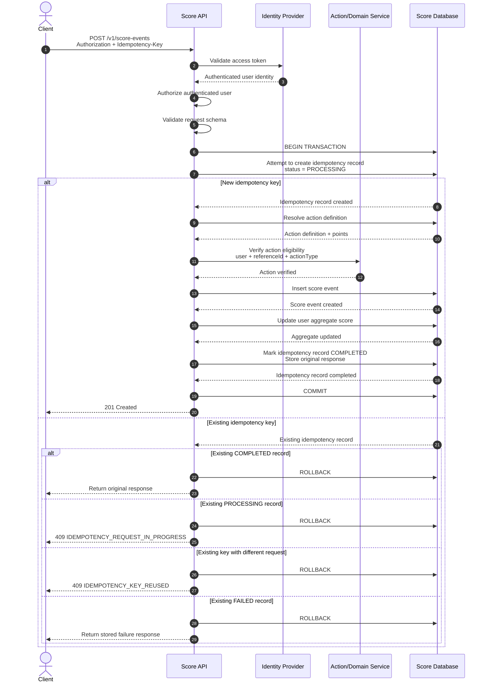
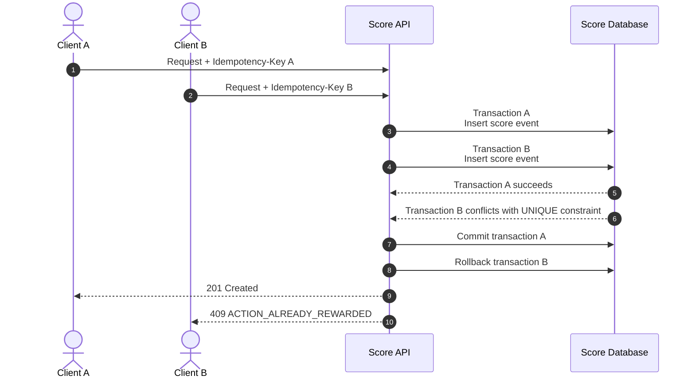

# Score Event Sequence

## 1. Purpose

This sequence describes the processing flow for:

```text
POST /v1/score-events
```

The flow demonstrates:

- authentication;
- authorization;
- request validation;
- action verification;
- server-side point calculation;
- idempotency handling;
- duplicate business-action protection;
- transactional persistence;
- aggregate score update.

---

## 2. Main Success Flow



---

## 3. Main Processing Stages

### 3.1 Authentication

The client sends:

```http
Authorization: Bearer <access-token>
```

The Score API delegates token validation to the configured Identity Provider.

The Score API obtains the authenticated user identity from the token.

The client does not provide the authoritative `userId` in the request body.

---

### 3.2 Authorization

Authentication establishes who the user is.

Authorization determines whether the authenticated user is allowed to perform the requested score-producing action.

The authorization context considers:

```text
authenticated user
+
requested action
+
referenced resource
```

The Score API must ensure that:

```text
authenticated user
        =
user receiving the reward
```

A client must not be able to submit a score event for another user by providing another user's identifier.

---

### 3.3 Request Validation

The API validates the request against the OpenAPI contract.

The request contains:

```json
{
  "actionType": "ACTION_COMPLETED",
  "referenceId": "action-123"
}
```

The client does not provide:

```text
userId
points
totalScore
```

These values are determined or derived by the server.

Authentication, authorization, and request validation failures occur before the score mutation and therefore do not create a score event.

---

### 3.4 Idempotency Key Claim

The authenticated user's identity and the supplied idempotency key form the uniqueness scope:

```text
UNIQUE(user_id, idempotency_key)
```

The service begins the database transaction and attempts to create:

```text
status = PROCESSING
```

If the insert succeeds, the current request owns the idempotency key.

If the insert conflicts with an existing record, the service inspects the existing record and its `request_hash`.

---

### 3.5 Existing Idempotency Record

The service handles existing records according to their state.

#### `COMPLETED`

The original response is returned.

No action verification is performed again.

No score event is inserted.

No additional points are awarded.

#### `PROCESSING`

Another request is currently processing the same idempotency key.

The API returns:

```text
409 IDEMPOTENCY_REQUEST_IN_PROGRESS
```

No score event is created by the second request.

#### `FAILED`

The previously stored replayable failure response is returned.

No score event is created.

#### Same Key With Different Payload

If the stored `request_hash` does not match the incoming request:

```text
409 IDEMPOTENCY_KEY_REUSED
```

The request is rejected.

---

## 4. Action Resolution

For a new idempotency key, the API resolves:

```text
actionType
    ↓
action_definitions.code
    ↓
action_definition_id
```

The action definition provides the server-side scoring rule.

For example:

```text
ACTION_COMPLETED
        ↓
action_definition_id = act-001
        ↓
points = 10
```

The client cannot override the configured points.

---

## 5. Action Eligibility Verification

The Score API or the relevant domain/action service verifies that the referenced action actually occurred and is eligible for scoring.

The verification is based on:

```text
authenticated user
+
actionType
+
referenceId
```

The Score API must not blindly trust a client-provided `referenceId` as proof that an action occurred.

If the action is not eligible, the request fails without awarding points.

For replayable application-level failures, the idempotency record may be completed with:

```text
status = FAILED
```

and the original failure response.

Unexpected infrastructure or database failures cause the transaction to roll back.

---

## 6. Score Persistence

After the action has been verified, the API performs the score mutation inside the same transaction.

The sequence is:

```text
BEGIN TRANSACTION

    idempotency record
    status = PROCESSING

    ↓

    INSERT score_event

    ↓

    UPDATE user_scores

    ↓

    UPDATE idempotency record
    status = COMPLETED
    response_status = 201
    response_body = <original response>

COMMIT
```

The successful response is returned only after the transaction commits.

---

## 7. Idempotent Retry

If a client does not receive the original response because of a network failure, it can retry the request with the same idempotency key.

Example:

```text
Request 1

Idempotency-Key: abc123
ACTION_COMPLETED / action-123
```

The request completes successfully.

Later:

```text
Request 2

Idempotency-Key: abc123
ACTION_COMPLETED / action-123
```

The service finds the existing `COMPLETED` idempotency record and returns the stored original response.

No additional:

```text
score_event
```

is created.

No additional points are awarded.

---

## 8. Idempotency Key Reuse

If the same user sends the same idempotency key with a different request payload:

```text
Request A

Idempotency-Key: abc123
ACTION_COMPLETED / action-123
```

followed by:

```text
Request B

Idempotency-Key: abc123
ACTION_COMPLETED / action-456
```

the calculated request hash differs.

The second request must be rejected:

```text
409 IDEMPOTENCY_KEY_REUSED
```

The original operation remains unchanged.

---

## 9. Duplicate Business Action

Idempotency protection and business-action duplicate protection solve different problems.

Two requests may use different idempotency keys while attempting to reward the same business action.



The database uniqueness constraint is:

```text
UNIQUE(
    user_id,
    action_definition_id,
    reference_id
)
```

This is the final protection against duplicate rewards.

Idempotency keys do not replace this business-level constraint.

---

## 10. Concurrent Requests

Two requests can arrive concurrently for the same business action.

Application-level existence checks alone are insufficient because both requests may observe the action as not yet rewarded.

The database uniqueness constraint provides the final protection.

Only one transaction can successfully create:

```text
(user_id, action_definition_id, reference_id)
```

The competing transaction receives a uniqueness conflict and must not update `user_scores`.

Expected response:

```text
409 ACTION_ALREADY_REWARDED
```

---

## 11. Failure Scenarios

### Authentication failure

```text
Invalid or expired token
        ↓
401 Unauthorized
```

No idempotency record is created.

### Authorization failure

```text
Authenticated user is not authorized
for the requested action/resource
        ↓
403 Forbidden
```

No score event is created.

### Validation failure

```text
Invalid request
        ↓
400 Bad Request
```

No idempotency record is created.

### Action not eligible

```text
Action verification fails
        ↓
4xx domain-specific response
```

No score is awarded.

If the request has already claimed an idempotency key, the failure may be stored as a replayable `FAILED` result.

### Idempotency key reused

```text
Same key + different request
        ↓
409 IDEMPOTENCY_KEY_REUSED
```

No score event is created.

### Idempotency request in progress

```text
Same user + same key
and existing status = PROCESSING
        ↓
409 IDEMPOTENCY_REQUEST_IN_PROGRESS
```

No score event is created by the second request.

### Business action already rewarded

```text
UNIQUE constraint violation
        ↓
409 ACTION_ALREADY_REWARDED
```

The competing transaction is rolled back and no additional score is awarded.

### Unexpected database or infrastructure failure

```text
Transaction failure
        ↓
ROLLBACK
        ↓
5xx response
```

The idempotency record, score event, and aggregate score are rolled back together.

---

## 12. Transaction and Consistency Rules

The following operations belong to the same transaction for a new score-producing request:

```text
Create idempotency record
        +
Insert score event
        +
Update user score
        +
Complete idempotency record
```

A successful request commits all four changes together.

An unexpected transaction failure rolls back all four changes together.

This guarantees consistency between:

```text
idempotency state
score event
aggregate score
```

---

## 13. Architectural Invariants

The following invariants must always hold:

1. The authenticated identity determines the user receiving the score.
2. The client cannot choose the number of points awarded.
3. An action must be verified before points are awarded.
4. The same idempotency key cannot represent two different requests.
5. The same business action cannot receive the same reward twice.
6. `score_events` and `user_scores` are updated atomically.
7. Historical score events are immutable.
8. A successful score response is returned only after transaction commit.
9. An unexpected infrastructure failure cannot leave a partial score mutation committed.
10. A completed idempotent request can be safely replayed without awarding points again.
