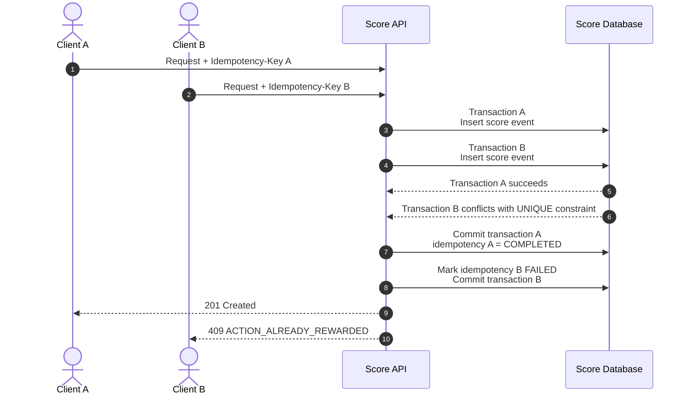

# Score Event Sequence

## 1. Purpose

This sequence describes the processing flow for:

```text
POST /v1/score-events
```

The flow demonstrates:

- authentication;
- authorization;
- request validation;
- action verification;
- server-side point calculation;
- idempotency handling;
- duplicate business-action protection;
- transactional persistence;
- aggregate score update.

---

## 2. Main Success Flow

```mermaid
sequenceDiagram
    autonumber

    actor Client
    participant API as Score API
    participant IDP as Identity Provider
    participant Action as Action/Domain Service
    participant DB as Score Database

    Client->>API: POST /v1/score-events<br/>Authorization + Idempotency-Key

    API->>IDP: Validate access token
    IDP-->>API: Authenticated user identity

    API->>API: Authorize authenticated user

    API->>API: Validate request schema

    API->>DB: Look up idempotency record<br/>(user_id, idempotency_key)

    alt Existing COMPLETED record
        DB-->>API: Stored response
        API-->>Client: Return original response

    else Existing PROCESSING record
        DB-->>API: Existing record
        API-->>Client: 409 IDEMPOTENCY_REQUEST_IN_PROGRESS

    else Existing key with different request
        DB-->>API: Request hash mismatch
        API-->>Client: 409 IDEMPOTENCY_KEY_REUSED

    else Existing FAILED record
        DB-->>API: Stored failure response
        API-->>Client: Return stored failure response

    else No existing record

        DB-->>API: No idempotency record found

        API->>DB: Resolve action definition
        DB-->>API: Action definition + points

        API->>Action: Verify action eligibility<br/>user + referenceId + actionType
        Action-->>API: Eligibility result

        alt Action not eligible
            API-->>Client: 4xx domain-specific response<br/>(not persisted; safe to retry)

        else Action verified

            API->>DB: BEGIN TRANSACTION

            API->>DB: Atomically claim idempotency key<br/>status = PROCESSING

            alt Claim conflicts with concurrent request
                API->>DB: ROLLBACK
                API-->>Client: 409 IDEMPOTENCY_REQUEST_IN_PROGRESS

            else Claim succeeded
                API->>DB: Insert score event

                alt Business uniqueness conflict
                    DB-->>API: UNIQUE constraint violation
                    API->>DB: Mark idempotency record FAILED<br/>response_status = 409
                    API->>DB: COMMIT
                    API-->>Client: 409 ACTION_ALREADY_REWARDED

                else Score event created
                    DB-->>API: Score event created

                    API->>DB: Update user aggregate score
                    DB-->>API: Aggregate updated

                    API->>DB: Mark idempotency record COMPLETED<br/>Store original response
                    DB-->>API: Idempotency record completed

                    API->>DB: COMMIT
                    API-->>Client: 201 Created
                end
            end
        end
    end
```

---

## 3. Main Processing Stages

### 3.1 Authentication

The client sends:

```http
Authorization: Bearer <access-token>
```

The Score API delegates token validation to the configured Identity Provider.

The Score API obtains the authenticated user identity from the token.

The client does not provide the authoritative `userId` in the request body.

---

### 3.2 Authorization

Authentication establishes who the user is.

Authorization determines whether the authenticated user is allowed to perform the requested score-producing action.

The authorization context considers:

```text
authenticated user
+
requested action
+
referenced resource
```

The Score API must ensure that:

```text
authenticated user
        =
user receiving the reward
```

A client must not be able to submit a score event for another user by providing another user's identifier.

---

### 3.3 Request Validation

The API validates the request against the OpenAPI contract.

The request contains:

```json
{
  "actionType": "ACTION_COMPLETED",
  "referenceId": "action-123"
}
```

The client does not provide:

```text
userId
points
totalScore
```

These values are determined or derived by the server.

Authentication, authorization, and request validation failures occur before the score mutation and therefore do not create a score event.

---

### 3.4 Idempotency Pre-check

The authenticated user's identity and the supplied idempotency key form the uniqueness scope:

```text
UNIQUE(user_id, idempotency_key)
```

Before any database transaction is opened, the service performs a read-only lookup for an existing idempotency record matching this scope.

This lookup allows a replayed request to short-circuit immediately with the stored outcome, without resolving the action, calling the Action/Domain Service, or opening a transaction.

If no record exists, the request proceeds to action resolution and eligibility verification. The idempotency key itself is not claimed at this point — it is claimed atomically inside the database transaction only after the action has been verified (see Section 6).

---

### 3.5 Existing Idempotency Record

The service handles existing records according to their state.

#### `COMPLETED`

The original response is returned.

No action verification is performed again.

No score event is inserted.

No additional points are awarded.

#### `PROCESSING`

Another request is currently processing the same idempotency key.

The API returns:

```text
409 IDEMPOTENCY_REQUEST_IN_PROGRESS
```

No score event is created by the second request.

#### `FAILED`

The previously stored replayable failure response is returned.

No score event is created.

#### Same Key With Different Payload

If the stored `request_hash` does not match the incoming request:

```text
409 IDEMPOTENCY_KEY_REUSED
```

The request is rejected.

---

## 4. Action Resolution

Action resolution happens after the idempotency pre-check and before any database transaction is opened. No transaction is held open while the API waits on this step.

For a request with no existing idempotency record, the API resolves:

```text
actionType
    ↓
action_definitions.code
    ↓
action_definition_id
```

The action definition provides the server-side scoring rule.

For example:

```text
ACTION_COMPLETED
        ↓
action_definition_id = act-001
        ↓
points = 10
```

The client cannot override the configured points.

---

## 5. Action Eligibility Verification

The Score API or the relevant domain/action service verifies that the referenced action actually occurred and is eligible for scoring.

This verification is an external call and is performed before any database transaction is opened, so the transaction never waits on the Action/Domain Service.

The verification is based on:

```text
authenticated user
+
actionType
+
referenceId
```

The Score API must not blindly trust a client-provided `referenceId` as proof that an action occurred.

If the action is not eligible, the request fails without awarding points.

Because verification happens before the idempotency key is claimed, this failure is not persisted as an idempotency result. Verification has no side effects, so it is always safe for the client to retry the same idempotency key once the eligibility conditions change.

`FAILED` is reserved for a different case, described in Section 6: a business-uniqueness conflict discovered during the transactional write.

---

## 6. Score Persistence

Only after the action has been verified does the API open a database transaction. The transaction wraps the idempotency claim and the score mutation together; it never spans the external verification call.

The sequence is:

```text
BEGIN TRANSACTION

    Atomically claim idempotency key
    status = PROCESSING

    INSERT score_event

    IF UNIQUE constraint violation (business-uniqueness conflict):
        Mark idempotency record FAILED
        response_status = 409 (ACTION_ALREADY_REWARDED)
        (score event and aggregate update are not persisted)

    ELSE (insert succeeded):
        UPDATE user_scores
        Mark idempotency record COMPLETED
        response_status = 201
        response_body = <original response>

COMMIT
```

If the idempotency claim itself conflicts with a concurrent request using the same key, the transaction rolls back and the API returns `409 IDEMPOTENCY_REQUEST_IN_PROGRESS`.

If the score event insert conflicts with the business-uniqueness constraint, the transaction does not roll back entirely. Instead, the idempotency record is marked `FAILED` with the resulting `409 ACTION_ALREADY_REWARDED` response and the transaction commits. This memoizes the outcome under this idempotency key, so a client retry with the same key returns the same `409` immediately instead of re-attempting the insert.

Any unexpected infrastructure or database failure at any point in the transaction causes a full `ROLLBACK`.

The successful response is returned only after the transaction commits.

---

## 7. Idempotent Retry

If a client does not receive the original response because of a network failure, it can retry the request with the same idempotency key.

Example:

```text
Request 1

Idempotency-Key: abc123
ACTION_COMPLETED / action-123
```

The request completes successfully.

Later:

```text
Request 2

Idempotency-Key: abc123
ACTION_COMPLETED / action-123
```

The service finds the existing `COMPLETED` idempotency record and returns the stored original response.

No additional:

```text
score_event
```

is created.

No additional points are awarded.

---

## 8. Idempotency Key Reuse

If the same user sends the same idempotency key with a different request payload:

```text
Request A

Idempotency-Key: abc123
ACTION_COMPLETED / action-123
```

followed by:

```text
Request B

Idempotency-Key: abc123
ACTION_COMPLETED / action-456
```

the calculated request hash differs.

The second request must be rejected:

```text
409 IDEMPOTENCY_KEY_REUSED
```

The original operation remains unchanged.

---

## 9. Duplicate Business Action

Idempotency protection and business-action duplicate protection solve different problems.

Two requests may use different idempotency keys while attempting to reward the same business action.



The database uniqueness constraint is:

```text
UNIQUE(
    user_id,
    action_definition_id,
    reference_id
)
```

This is the final protection against duplicate rewards.

Idempotency keys do not replace this business-level constraint. Client B's transaction still commits — only the score event insert is discarded, while the idempotency record for key B is persisted as `FAILED`. This means a retry using key B returns the same `409 ACTION_ALREADY_REWARDED` immediately, without repeating the insert attempt.

---

## 10. Concurrent Requests

Two requests can arrive concurrently for the same business action.

Application-level existence checks alone are insufficient because both requests may observe the action as not yet rewarded.

The database uniqueness constraint provides the final protection.

Only one transaction can successfully create:

```text
(user_id, action_definition_id, reference_id)
```

The competing transaction receives a uniqueness conflict and must not update `user_scores`. It still commits its own idempotency record as `FAILED`, so a retry under that request's idempotency key does not repeat the conflict.

Expected response:

```text
409 ACTION_ALREADY_REWARDED
```

---

## 11. Failure Scenarios

### Authentication failure

```text
Invalid or expired token
        ↓
401 Unauthorized
```

No idempotency record is created.

### Authorization failure

```text
Authenticated user is not authorized
for the requested action/resource
        ↓
403 Forbidden
```

No score event is created.

### Validation failure

```text
Invalid request
        ↓
400 Bad Request
```

No idempotency record is created.

### Action not eligible

```text
Action verification fails
        ↓
4xx domain-specific response
```

No score is awarded. No idempotency record exists at this point, because verification happens before the idempotency key is claimed. The client may safely retry the same idempotency key once the eligibility conditions change, without triggering an `IDEMPOTENCY_KEY_REUSED` conflict.

### Idempotency key reused

```text
Same key + different request
        ↓
409 IDEMPOTENCY_KEY_REUSED
```

No score event is created.

### Idempotency request in progress

```text
Same user + same key
and existing status = PROCESSING
        ↓
409 IDEMPOTENCY_REQUEST_IN_PROGRESS
```

No score event is created by the second request.

### Business action already rewarded

```text
UNIQUE constraint violation
        ↓
409 ACTION_ALREADY_REWARDED
```

No additional score is awarded. The score event insert is discarded, but the transaction still commits with the idempotency record marked `FAILED`, so the outcome is memoized under that idempotency key.

### Unexpected database or infrastructure failure

```text
Transaction failure
        ↓
ROLLBACK
        ↓
5xx response
```

The idempotency record, score event, and aggregate score are rolled back together.

---

## 12. Transaction and Consistency Rules

Action resolution and action eligibility verification are read-only and external-facing steps that occur before any database transaction is opened. They are never part of the transaction and never hold a database connection open while the API waits on the Identity Provider or the Action/Domain Service.

The following operations belong to the same transaction for a new score-producing request:

```text
Claim idempotency key
        +
Insert score event
        +
Update user score (on success)
        +
Complete idempotency record (COMPLETED or FAILED)
```

A successful request commits all of these changes together.

A business-uniqueness conflict on the score event still commits, but only the idempotency record is completed (as `FAILED`); the score event and aggregate update are not persisted.

An unexpected infrastructure or database failure rolls the entire transaction back, including the idempotency claim.

This guarantees consistency between:

```text
idempotency state
score event
aggregate score
```

while keeping the transaction's duration bounded to database-only work.

---

## 13. Architectural Invariants

The following invariants must always hold:

1. The authenticated identity determines the user receiving the score.
2. The client cannot choose the number of points awarded.
3. An action must be verified before points are awarded.
4. The same idempotency key cannot represent two different requests.
5. The same business action cannot receive the same reward twice.
6. `score_events` and `user_scores` are updated atomically.
7. Historical score events are immutable.
8. A successful score response is returned only after transaction commit.
9. An unexpected infrastructure failure cannot leave a partial score mutation committed.
10. A completed idempotent request can be safely replayed without awarding points again.
11. The database transaction never spans a call to the Identity Provider or the Action/Domain Service; action verification always completes before the transaction is opened.
